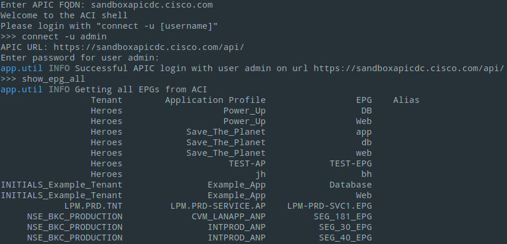
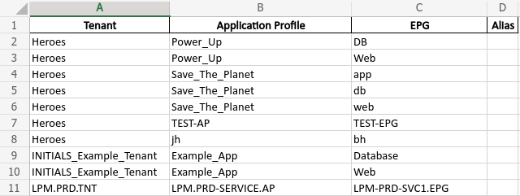

# ACI Report Shell

[](https://developer.cisco.com/codeexchange/github/repo/Anyweb/ACI-Report-Shell)

Interactive shell application to gather information and generate reports from a Cisco ACI environment.



## Use Case Description

Working with the Cisco APIC GUI can be cumbersome at times, especially when you need a quick overview and are used to simple CLI **show** commands.
In addition there's no sane and fast way to export data presented in the GUI to an Excel spreadsheet.

This is where **ACI Report Shell** comes into play. The goal of the application is to provide some simple CLI **show** commands to the user which can be used to
gather configuration or status information from the ACI fabric. If desired, the output from a show command can be exported to Excel. This can be helpful if you want to use the data elsewhere. For Example as an input file for configuration changes.

At the moment only a few commands are available. Future releases will include a larger set of commands.

## Installation

The code is built and tested against **Python 3.8** but should also work with older 3.x versions of Python.

The main dependencies are:

- cmd2
- coloredlogs
- configparser
- openpyxl
- pandas
- requests

### With poetry

If [Poetry](https://python-poetry.org/) is available on your system, you can install the software as follows:

```cli
poetry install
chmod +x ./aci-shell.py
```

### Without poetry

Otherwise you can use [Pip](https://pip.pypa.io/en/stable/user_guide/#) to install the software as follows:

```cli
pip install -r requirements.txt
chmod +x ./aci-shell.py
```

## Configuration

Some aspects of the application can be configured in the [config.ini](./config.ini) file. The following settings are available:

| Section  | Setting                        | Default                     | Description                                                                                      |
| -------- | ------------------------------ | --------------------------- | ------------------------------------------------------------------------------------------------ |
| common   | report_dir                     | ./reports                   | Path to report directory                                                                         |
| security | allow_unverified_https_request | true                        | Allow unverified HTTPS requests                                                                  |
| logging  | log_file                       | ./logs/aci-report-shell.log | Path to log file                                                                                 |
| logging  | log_level                      | INFO                        | Logging level. <br> Allowed values: **DEBUG**, **INFO**, **WARNING**, **ERROR**, **CRITICAL**    |
| logging  | log_rotation                   | W0                          | Weekday when new logfile will be written <br> Allowed values: **W0** - **W6**, where W0 = Monday |
| logging  | log_backup                     | 25                          | Number of log files which will be kept before they get deleted                                   |

## Usage

To start the application simply open a terminal window and run **aci-shell.py**

```cli
$ ./aci-shell.py
```

You will then be asked to enter the FQDN of your APIC.

```cli
Enter APIC FQDN: sandboxapicdc.cisco.com
```

Once you enterd the FQDN and hit "enter" you will be presented with the welcome screen.

```
Welcome to the ACI shell
Please login with "connect -u [username]"
>>>
```

### General

Since the application is using [cmd2](https://github.com/python-cmd2/cmd2) as the CLI, you can use the built-in features such as:

- tab completion of commands
- show help for a command (**-h** or **--help** command)
- Searchable command history (**history** and **Ctrl+r** command)
- Pipe command output to shell commands with **|**
- Redirect command output to file with **>**, **>>**
- Command aliasing similar to bash alias command

### Connect to APIC

To establish a connection to the APIC, use the **connect** command and provide the username with the **-u** argument.

You will then be asked to enter the password for the user.

```cli
>>> connect -u admin
APIC URL: https://sandboxapicdc.cisco.com/api/
Enter password for user admin:
```

### Disconnect from APIC

To disconnect from the APIC you can use the **disconnect** command.

```cli
>>> disconnect
```

### Show all EPGs in all Tenants

For a report of all EPGs in all Tenants, use the **show_epg_all** command.

```cli
>>> show_epg_all
```

### Show interface status of a switch

For a report on the interface status of a switch, use the **show_interface_status** command.

```cli
>>> show_interface_status -p 1 -n 101
```

### Show EPGs deployed on a switch interface

For a report of all deployed EPGs on a switch interface, use the **show_interface_epg** command.

```cli
>>> show_interface_epg -p 1 -n 101 -i eth1/38
```

### Export report to Excel

Every report can be exported to an Excel spreadsheet. Simply add the **-e** or **--export** argument to the show commands.

**_Example:_**

```cli
>>> show_epg_all --export aci-report.xlsx
```

By default the report will be saved to the **./reports** directory.



You can save multiple reports to the same file. Simply use the same filename in the **-e** argument.
Each show command will create a new worksheet.

For demonstration purposes there's a [sample report](./reports/sample-report.xlsx) in the **reports** directory.

### DevNet Sandbox

To try out the application you can use the [Cisco ACI Sandbox Lab](https://sandboxapicdc.cisco.com).
Sandbox details such as username & password can be found [here](https://devnetsandbox.cisco.com/RM/Diagram/Index/5a229a7c-95d5-4cfd-a651-5ee9bc1b30e2?diagramType=Topology).

## Known issues

Currently this application will not run on Windows directly. But you can use [Windows Subsystem for Linux](https://docs.microsoft.com/en-us/windows/wsl/install-win10) instead.
Linux and macOS are supported out of the box, as long as you have Python3 installed.

## Getting help

If you have questions, concerns, bug reports, etc., please create an [issue](https://gitlab.com/anyweb/cisco-code-exchange/aci-report-shell/-/issues) against this repository.

## Author(s)

This project was written and is maintained by the following individuals:

- Stephan Lüscher <stephan.luescher@anyweb.ch>
